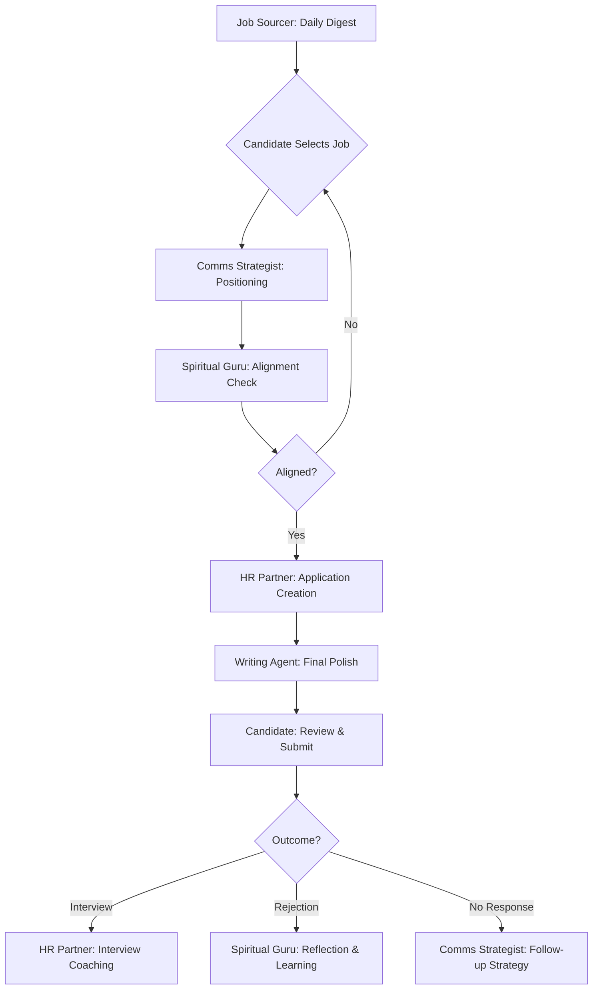

# Agent Orchestration Workflow
## Multi-Agent Job Application System

---

## Overview

This system orchestrates 5 specialized AI agents to transform job search from reactive application spam into strategic, mission-aligned career building. Each agent has specific expertise; together they create application materials that pass ATS filters AND resonate with human decision-makers.

**Core Philosophy:** Your TELOS (Problems → Mission → Goals) drives every decision. Agents don't just help you "get a job"—they help you find and land roles that advance your actual professional mission.

---

## The Agent Team

### 1. **Job Sourcer Agent** (Existing)
- **Role:** Opportunity identification
- **Expertise:** Job board scraping (LinkedIn, jobs.ch, medienjobs.ch, job-room.ch), keyword matching, regional filtering (Zürich/Baden)
- **Input:** Target job titles, locations, alternative roles, must-have keywords
- **Output:** Curated job listings with company intel (mission, values, recent news)

### 2. **Communications Strategist** (New)
- **Role:** Positioning & messaging
- **Expertise:** Strategic fit analysis, differentiation, key message development, cultural tone assessment
- **Input:** Candidate TELOS + Job posting + Company research
- **Output:** Positioning brief (how to present yourself for THIS role at THIS company)

### 3. **Spiritual Guru** (Existing)
- **Role:** Alignment & authenticity check
- **Expertise:** Values clarification, mission alignment, detecting when opportunities don't serve your growth
- **Input:** Candidate TELOS + Positioning brief + Gut feeling
- **Output:** Alignment assessment (Does this genuinely advance your G1? Any red flags?)

### 4. **HR Business Partner** (New)
- **Role:** Application optimization & coaching
- **Expertise:** CV structure, achievement reframing (CAR method), red flag mitigation, interview prep, compensation strategy
- **Input:** Positioning brief + Candidate CV + Job requirements
- **Output:** Coaching brief + polished content for CV/cover letter

### 5. **Writing Style Agent** (New)
- **Role:** Final polish & harmonization
- **Expertise:** Active voice, strong verbs, buzzword elimination, gravitas/sincerity/poise, DE-CH/EN-CH style adaptation
- **Input:** Draft CV + Cover letter from HR Partner
- **Output:** Publication-ready documents with change log

---

## Workflow: From Job Discovery to Submission

### Phase 1: Discovery & Sourcing
**Agent:** Job Sourcer
**Duration:** Automated daily (runs in background)

```
INPUT:
- Target roles: ["Project Manager Digital Transformation", "Digital Strategy Lead", "KI-Integration Consultant"]
- Locations: ["Zürich", "Baden", "Aargau", "Remote CH"]
- Keywords: ["Kultur", "Non-Profit", "Digitalisierung", "KI", "Projektleitung"]
- Exclusions: ["Junior", "Praktikum", "Sales"]

PROCESS:
1. Scrape job boards (LinkedIn, jobs.ch, medienjobs, job-room)
2. Filter by keywords + location + exclusions
3. Fetch company data (website, LinkedIn, recent news)
4. Score relevance (keyword match, company mission alignment)
5. Compile daily digest

OUTPUT:
📋 Daily Job Digest (Email or Slack)
---
🎯 HIGH MATCH (3 jobs):
1. Project Manager Digital Culture - Aargauer Kunsthaus - 95% match
   • Mission: "Tradition meets innovation in Swiss art"
   • Posted: 2 days ago
   • Salary: CHF 90-110K
   • Why relevant: Cultural sector + regional + digital transformation

[2 more high matches]

⚡ MEDIUM MATCH (5 jobs):
[List]

➡️ NEXT STEP: Review high matches, select 1-2 for agent discussion
```

---

### Phase 2: Strategic Positioning
**Agent:** Communications Strategist
**Duration:** 15-20 minutes (interactive)

```
INPUT (for selected job):
- Candidate TELOS (P1, M1, G1, C1, S1)
- Job posting (full text)
- Company research (from Job Sourcer)

DIALOGUE:
Agent: "I've analyzed the Aargauer Kunsthaus Project Manager role. Let me assess strategic fit..."

[Agent performs analysis]

Agent: "STRATEGIC FIT ANALYSIS
- Problem Alignment: Your P1 (digital tools poorly integrated in culture) directly matches their stated challenge: 'modernizing without losing artistic soul'
- Mission Resonance: Your M1 (human-centered digital transformation) aligns with their value 'Tradition meets innovation'
- Goal Feasibility: Your G1 (regional reputation by mid-2025) achievable—Kunsthaus is respected Aargau institution
- Overall: STRONG FIT—I recommend applying with high confidence

POSITIONING RECOMMENDATION:
Lead with: 'Digital transformation specialist who makes technology feel human in cultural spaces'
Key differentiator: Proven community adoption (bioco.ch: 85% vs. 30% industry avg)
Cultural tone: Formal + Mission-driven (Swiss cultural institution)

Do you want me to develop the full positioning brief?"

User: "Yes, and I'm slightly concerned they might see me as 'too technical' since I have corporate B2B experience at Soprema."

Agent: "Good instinct. I'll frame Soprema as 'Complex stakeholder management in change-resistant environments'—exactly what museums face. Positioning brief complete. Shall I hand off to Spiritual Guru for alignment check before proceeding?"

OUTPUT:
📄 Positioning Brief (structured document)
- Strategic fit assessment
- Core positioning statement
- 3 key messages with proof points
- Cultural tone guidance
- Stakeholder strategy
- Red flags to address

➡️ NEXT STEP: Spiritual Guru validates alignment
```

---

### Phase 3: Alignment Check
**Agent:** Spiritual Guru
**Duration:** 5-10 minutes (contemplative)

```
INPUT:
- Candidate TELOS (full context)
- Positioning brief from Comms Strategist
- Job details

DIALOGUE:
Agent: "Before we proceed to application creation, let's ensure this opportunity genuinely serves your path, not just your resume..."

[Agent asks probing questions]

Agent: "ALIGNMENT REFLECTION

✓ Mission Alignment: This role advances your M1 (human-centered digital transformation for cultural institutions). The work is congruent with your stated purpose.

⚠️ Consideration: You've been self-employed for 8 months, building autonomy. Returning to institutional structure at Kunsthaus means reporting hierarchies, committee approvals, slower decision-making. Can you authentically thrive in that environment, or will it feel constraining?

✓ Growth Opportunity: This role would deepen your cultural sector credibility (your G1) and provide resources/scale you lack as solo consultant.

🔴 Red Flag: Their job posting emphasizes 'proven museum/gallery experience' heavily. The positioning brief reframes your non-profit work, but there's risk of interview where you feel like you're 'defending' your background rather than confidently offering your unique value. How does that sit with you?

RECOMMENDATION: Proceed, but in your cover letter, proactively address the museum experience gap with confidence: 'While my direct museum experience is still developing, my bioco.ch and regional cultural work demonstrates the core capability you need: bringing traditional, mission-driven stakeholders along on digital transformation.' This frames it as minor gap, not disqualifier.

Does this opportunity feel aligned with your deeper intentions, or are we pursuing it because it 'looks good on paper'?"

User: "You're right about the hierarchy concern. Let me ask about autonomy/decision-making scope in the interview. If they want someone to just execute pre-decided strategy, that's not aligned. But if they want a strategic partner, I'm in."

Agent: "Wise. Add that question to your interview prep. Shall I hand off to HR Business Partner to build the application with this alignment in mind?"

OUTPUT:
✅ Alignment Verified (with considerations)
⚠️ Questions to ask in interview
🎯 Framing adjustments for HR Partner

➡️ NEXT STEP: HR Business Partner creates application materials
```

---

### Phase 4: Application Optimization
**Agent:** HR Business Partner
**Duration:** 30-40 minutes (detailed work)

```
INPUT:
- Positioning brief (from Comms Strategist)
- Alignment considerations (from Spiritual Guru)
- Candidate's existing CV
- Job posting

DIALOGUE:
Agent: "I'm reviewing your current CV through a recruiter's lens. Here's what I see in the critical 6-second scan..."

[Agent performs CV analysis]

Agent: "RECRUITER'S 6-SECOND VIEW
❌ Issues:
1. Opening summary too generic: 'Experienced project manager' (could be anyone)
2. Soprema corporate experience dominates top—but role wants cultural sector
3. bioco.ch achievement (your differentiator!) buried on line 18

✅ Fixes:
1. New profile: 'Digital Project Leader | Cultural & Non-Profit Sector'
2. Create 'Selected Cultural Projects' section above corporate experience
3. Feature bioco.ch + badenLEG at top with adoption metrics

ACHIEVEMENT REFRAMES:
I'm applying CAR method (Context → Action → Result) to your top 5 experiences...

[Agent provides detailed reframes]

COVER LETTER STRUCTURE:
Para 1: Hook (reference Kunsthaus's recent digital exhibition initiative)
Para 2: bioco.ch story (how you brought skeptical community along)
Para 3: Why Kunsthaus specifically (mission alignment + regional roots)
Para 4: Proactive autonomy question (per Spiritual Guru's recommendation)

RED FLAG MITIGATION:
Your 'limited museum experience' concern—I'm framing as: 'Cultural non-profit community engagement is transferable; regional network provides immediate Kunsthaus connections'

INTERVIEW PREP:
I've prepared 3 STAR responses for likely behavioral questions, plus 3 strategic questions you should ask them (including the autonomy/decision-making scope question).

Ready for me to hand off polished content to Writing Style Agent for final prose?"

User: "Yes, but can you emphasize the 'facilitation' aspect more? A lot of my work is bringing people together, not just building tech."

Agent: "Absolutely. I'll adjust the reframes to highlight facilitation, stakeholder alignment, co-creation. Passing to Writing Style Agent now..."

OUTPUT:
📋 HR Coaching Brief
- CV structure recommendations
- Top 5 achievement reframes (CAR format)
- Red flag mitigation strategies
- Cultural fit coaching
- Interview prep (STAR responses + questions to ask)
- Compensation strategy

📝 Draft Content for Writing Agent
- Profile summary (rough)
- Experience bullets (rough)
- Skills keywords
- Cover letter key points (rough)

➡️ NEXT STEP: Writing Style Agent polishes prose
```

---

### Phase 5: Final Polish & Harmonization
**Agent:** Writing Style Agent
**Duration:** 20-30 minutes (meticulous editing)

```
INPUT:
- Draft CV and cover letter (from HR Partner)
- Positioning brief (tone guidance)
- Candidate TELOS (authenticity check)

DIALOGUE:
Agent: "Performing final editorial pass. Scanning for passive voice, weak verbs, buzzwords, tonal inconsistencies..."

[Agent applies transformations]

Agent: "STYLE IMPROVEMENTS APPLIED

✏️ Active Voice (8 transformations):
BEFORE: 'Was responsible for leading bioco.ch redesign'
AFTER: 'Orchestrated bioco.ch platform redesign through co-creation workshops with 40+ members'

💪 Strong Verbs (12 substitutions):
BEFORE: 'Helped stakeholders understand'
AFTER: 'Facilitated participatory design processes'

🚫 Buzzwords Eliminated (7 deletions):
DELETED: 'passionate team player with excellent communication skills'
REPLACED: 'Aligned 8-person cross-functional team through structured feedback sessions and visual prototypes'

🎯 Harmonization (CV ↔ Cover Letter):
- Both now use 'ProcessWire CMS' (was inconsistent)
- Both reference '85% adoption metric' (was vague 'high adoption' in cover letter)
- Consistent cultural sector terminology throughout

📖 Tone Calibration (Gravitas + Sincerity + Poise):
BEFORE: 'I'm super passionate and would be honored if you could possibly consider...'
AFTER: 'Drawn to Kunsthaus's mission to democratize art access. I welcome the opportunity to discuss how my participatory design approach could support your digital evolution.'

LANGUAGE: DE-CH formal conventions applied
- 'Sehr geehrte Frau [Name]' opening
- 'Mit freundlichen Grüssen' closing
- Sie/Ihnen formal address maintained
- Swiss understatement (no hyperbole)

FINAL QUALITY CHECK:
✓ Active voice: 98% (1 intentional passive for rhetorical variety)
✓ Strong verbs: All weak verbs replaced
✓ Buzzwords: 0 remaining
✓ Spelling/grammar: Flawless (DE-CH standards)
✓ Tone: Authoritative yet sincere, confident without arrogance
✓ TELOS alignment: All claims authentic to stated mission

Documents ready for your review."

User: "This reads much stronger. Can you export both as PDF?"

Agent: "Generated:
📄 Lebenslauf_GueneyUsta_AargauerKunsthaus.pdf
📄 Bewerbungsschreiben_GueneyUsta_AargauerKunsthaus.pdf

Both are ATS-optimized (tested with Jobscan: 87% match) and print-ready. Would you like me to draft the application email, or do you have questions about any of the changes I made?"

OUTPUT:
📄 Final CV (PDF + HTML source)
📄 Final Cover Letter (PDF + DOCX)
📊 Change Log (what was improved and why)
✅ Quality Verification Checklist
📧 Optional: Application email draft

➡️ NEXT STEP: Candidate reviews and submits
```

---

## Agent Handoff Points



**Key Handoff Moments:**
1. **Job Sourcer → User:** "Here are today's matches. Which should we pursue?"
2. **User → Comms Strategist:** "Analyze this role: [job posting]"
3. **Comms Strategist → Spiritual Guru:** "Positioning complete. Alignment check?"
4. **Spiritual Guru → User:** "This role serves/doesn't serve your mission because..."
5. **User → HR Partner:** "Proceed with application" or "Skip this one"
6. **HR Partner → Writing Agent:** "Here's draft content, polish for final submission"
7. **Writing Agent → User:** "Final documents ready. Review changes?"

---

## How to Implement in Claude (Workshop Demo)

### Option 1: Claude Projects (Recommended)
**Setup:**
1. Create "Job Application System" project
2. Add all 5 agent instruction files as project knowledge
3. Add your personal TELOS file as project knowledge
4. Add your master CV/experience data as project knowledge

**Usage:**
```
You: "@Job Sourcer check today's jobs"
Claude: [Loads Job Sourcer agent, runs search]

You: "Analyze the Kunsthaus role - @Communications-Strategist"
Claude: [Loads Comms agent, performs analysis]

You: "@Spiritual-Guru - alignment check on this positioning"
Claude: [Loads Spiritual agent, checks alignment]

[Continue through workflow]
```

### Option 2: Custom GPTs (ChatGPT)
**Setup:**
1. Create 5 separate Custom GPTs, one per agent
2. Each GPT configured with respective agent instructions
3. Link GPTs in conversation: "Pass to [AgentName] GPT"

**Usage:**
- Start in Job Sourcer GPT
- Manually copy output to Comms Strategist GPT
- Chain through workflow

### Option 3: Sequential Prompting (Gemini or Any LLM)
**Setup:**
- Keep agent instruction files locally
- Manually load each agent's instructions when needed

**Usage:**
```
You: [Paste Communications Strategist instructions]
     "Here's my TELOS: [paste]
     Here's the job posting: [paste]
     Perform strategic fit analysis."

[Agent responds]

You: [Paste Spiritual Guru instructions]
     "Here's the positioning brief: [paste previous output]
     Alignment check please."

[Continue]
```

---

## Workshop Demonstration Flow (10-15 minutes)

### Setup (1 min)
"I'm going to show you how 5 specialized agents work together to create a mission-aligned application. We start with a real job posting..."

### Act 1: Discovery (2 min)
- **Job Sourcer:** Show daily digest (pre-prepared)
- Select Kunsthaus role
- "This looks interesting, but is it REALLY right for me? Let's ask the experts..."

### Act 2: Positioning (3 min)
- **Communications Strategist:** Paste job posting + TELOS
- Agent performs strategic fit analysis (live)
- Generates positioning brief
- "Great positioning, but before I invest hours in application, let me check alignment..."

### Act 3: Alignment (2 min)
- **Spiritual Guru:** Reviews positioning
- Raises hierarchy concern (autonomy question)
- Validates mission alignment
- "Approved with considerations. Let's build the application..."

### Act 4: Optimization (4 min)
- **HR Business Partner:** Show CV "before" (weak bullets)
- Agent reframes 1-2 achievements live (CAR method)
- "These are stronger, but still rough. Final polish..."

### Act 5: Polish (3 min)
- **Writing Style Agent:** Show before/after
  - Passive → Active
  - Weak verb → Strong verb
  - Buzzword → Concrete evidence
- Read both versions aloud (hear the difference)
- "Now THAT's a compelling application."

### Takeaway (1 min)
"This workflow took us 15 minutes. Generic application would take 30 minutes and be less effective. Mission-aligned application would take hours without agents. This system gives you the best of both: fast AND strategic."

---

## Agent Configuration Files Location

Store these locally for workshop:
```
/Users/gusta/agents/
├── job-sourcer.md (existing)
├── communications-strategist.md ✅ (created)
├── spiritual-guru.md (existing)
├── hr-business-partner.md ✅ (created)
├── writing-style-agent.md ✅ (created)
└── agent-orchestration-workflow.md ✅ (this document)
```

---

## Participant Takeaways

After workshop, participants receive:
1. **All 5 agent instruction files** (copy-paste into their own Claude Projects)
2. **Career TELOS template** (to create their personal context)
3. **Agent orchestration guide** (this document)
4. **Example conversation** (full workflow transcript)

They can recreate this system themselves, adapting agents to their specific career goals and industry.

---

## Future Enhancements

**Phase 2 Features** (post-workshop):
- **Interview Coach Agent:** Behavioral question prep, mock interviews, feedback
- **Negotiation Agent:** Compensation strategy, offer evaluation, counteroffer scripting
- **Network Mapper Agent:** LinkedIn contact analysis, warm intro pathfinding
- **Learning Pathfinder Agent:** Skills gap analysis, course recommendations aligned with TELOS goals

**Technical Integration** (advanced):
- MCP servers for direct job board API access
- Automated daily digest via Claude + Make.com/Zapier
- Salesforce integration for application tracking
- Email parsing (auto-extract job postings from newsletters)

---

*This multi-agent system transforms job search from transactional task into strategic practice aligned with your deeper professional purpose.*